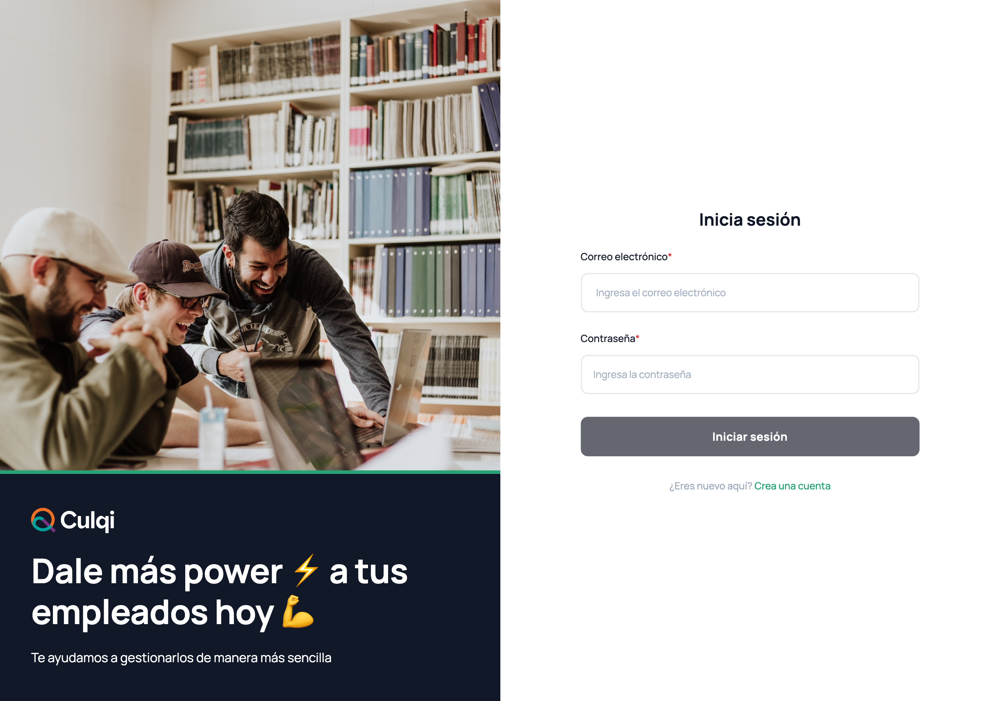
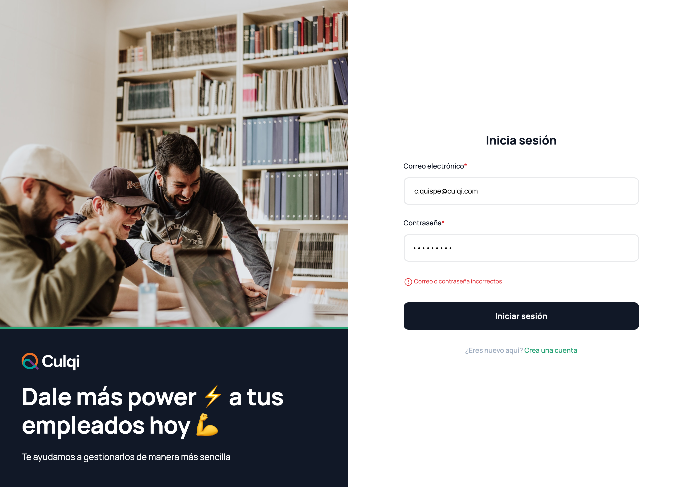
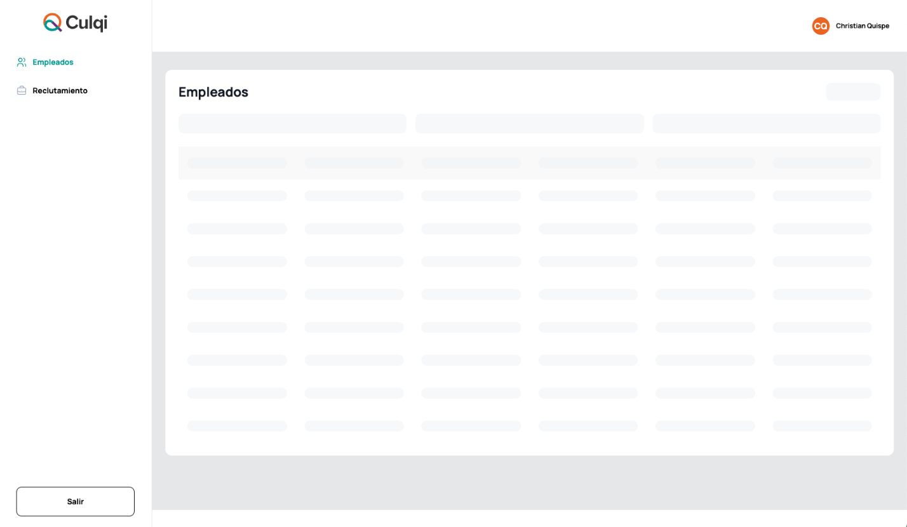
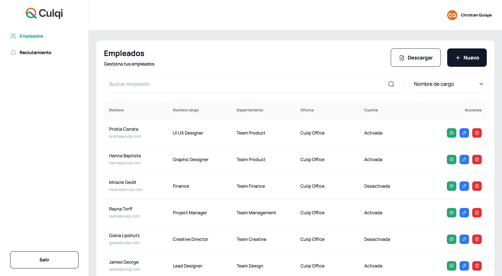

# Prueba Técnica FE - Culqi

Culqi desea ofrecer un sistema para el manejo de personal a los comercios que tiene como cliente.

Para ello se tiene un diseño que cubre dos funcionalidades básicas:

- Autenticación
- Listado de empleados

## LOGIN:

Default:

Error de correo o password:

## DASHBOARD:

Skeleton:

Listado de empleados:

